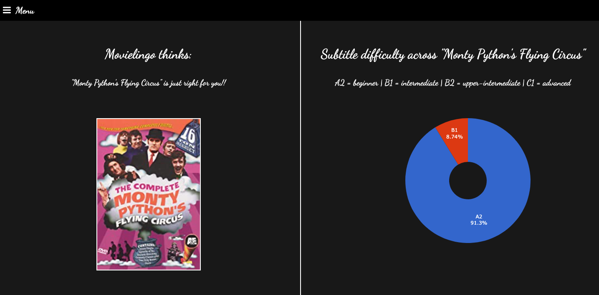

# [Movielingo](http://datainsight.host/)

*Watch and learn!*

### What is Movielingo

Communication abilities are key in our increasingly globalized world. Speaking a foreign language is often a key to success, especially if this language is English.

If you want to learn a language, you may hit a number of barriers: language classes are expensive and a big time committment, but it's also much more engaging than trying to learn a language all by yourself. Seeking an engaging and affordable learning experience, we often resort to watching movies and TV-shows in the language we want to learn. Selecting the movie in this case though can take hours of indecision. "This one sounds cool but would I be able to understand it or is the language in it too difficult?"

Movielingo uses deep learning to predict the difficulty of movie subtitles for English language learners.

### Using Movielingo

Enter your English proficiency level (Beginner/Intermediate or Upper-Intermediate/Advanced) and the title of the movie you want to watch. The app will analyze the subtitles of this movie, predicting for every group of 5 sentences in it, users at which language level will be able to understand it. Movielingo will then output a recommendation: is this movie too difficult or just right for you? You will also see how much of the text in the movie is likely to be understood at different levels of proficiency.

### How Movielingo works

 In this section, I will explain how I built Movielingo.

* Step 1: [Modelling language proficiency from text characteristics](#modelling-language-proficiency-from-text-characteristics)

* Step 2: [Inferring subtitle difficulty](#inferring-subtitle-difficulty)

* Step 3: [Building the app](#building-the-app)

I used Flask to build the app lokally and deployed it on AWS using Gunicorn. The plot in the results section is interactive and was implemented using the plotly library.

* Step 4: [What's next](#whats-next)

#### Modelling language proficiency from text characteristics

What are the features of text that are difficult for English learners? And which of these are likely to affect our understanding of a movie?

I analyzed [essays from > 1300 English learners](http://koreanlearnercorpusblog.blogspot.com/p/corpus.html). I cleaned the text and extracted basic NLP features from it using nltk. Then I engineered features of lexical and syntactic complexity: word frequencies, word length, sentence length, as well as metrics of syntactic complexity derived using the Stanford CoreNLP parser.

One important characteristic of the essay data is that they were user-entered online, which lead to a low signal-to-noise ratio. I took on a challenge seeing the promise of automatizing "grading" learners' text even if the text was done remotely, allowing learners to use the vocabulary and other resources. What I did not analyze is errors, because the model was later to be used to infer movie subtitle difficulty, and here any possible errors made by native English speakers (actors) are irrelevant.

I started with a simple linear regression, and had to build hypotheses and make decisions along the way, finally arriving at the best model for the data - a neural network classifying texts into lower (beginner and intermediate) vs. higher (upper-intermediate and advanced) English proficiency levels.

#### Inferring subtitle difficulty

There is no one-to-one mapping between language production and language comprehension, but they are not independent of one another. With the data available, our best bet for approximating subtitle difficutly is to rely on the features of learners' essays that are predictive of their language proficiency. Whether or not these approximations will be helpful needs validation (see "What's next" below).

When assessing movie subtitle difficulty, I downloaded the [SubIMDB subtitle corpus](http://ghpaetzold.github.io/subimdb/). When the user enters a movie title on Movielingo, the app scrapes movie ID from IMDB, finds the correct subtitle file in the database, and splits the subtitles into groups of 5 sentences. For each text group, the model predicts English proficiency level that could have produced that, be it produced by an English learner. The idea behind this is that if the learner could have produced this text themselves, they are likely to understand it as well.

#### What's next

Currently, there are no products like Movielingo, so my app is a good start. I am in the process of validating my approach by building a recommender based on model predictions and comparing it with a similarity-based recommender relying on the full array of features extracted from the texts prior to model fitting.
