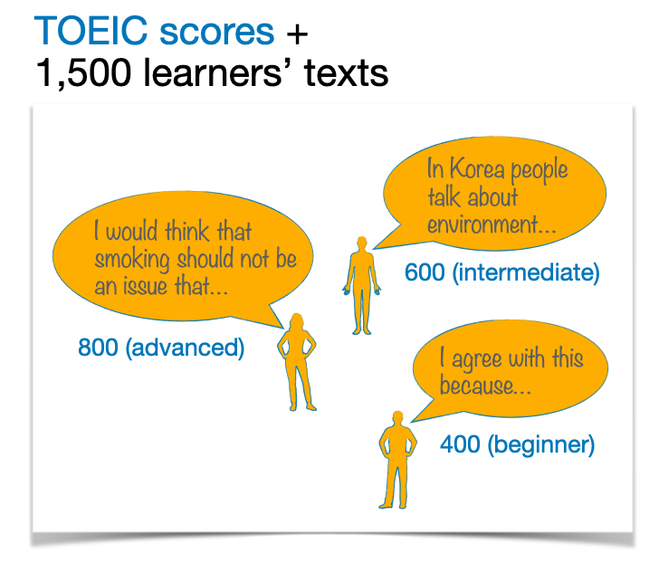

# [Movielingo](http://datainsight.host/)

*Watch and learn!*

### What is Movielingo

Communication abilities are key in our increasingly globalized world. Speaking a foreign language is often a key to success, especially if this language is English.

If you want to learn a language, you may hit a number of barriers: language classes are expensive and a big time commitment, but it's also much more engaging than trying to learn a language all by yourself. Seeking an engaging and affordable learning experience, we often resort to watching movies and TV-shows in the language we want to learn. Selecting the movie in this case though can take hours of indecision.

Movielingo uses deep learning and a recommendation algorithm to assess language difficulty of movie subtitles and based on this assessment, recommend movies for English language learners.

### Using Movielingo

1. Choose the movie genre you want to get recommendations for
2. Enter a title of a movie you've watched and understood well
3. The app will analyze the subtitles of the movie you entered and output two recommendations of movies that are similar to your movie in terms of English difficulty.

### How Movielingo works

Here is how I built Movielingo.

* Step 1: [Modelling language proficiency from text characteristics](#modelling-language-proficiency-from-text-characteristics)

* Step 2: [Building a recommender based on selected features](#building-a-recommender-based-on-selected-features)

* Step 3: [Deploying the app](#deploying-the-app)

* Step 4: [What's next](#whats-next)

* [Code organization + miscellaneous notes](#code-organization+miscellaneous-notes)

#### Modelling language proficiency from text characteristics

What are the features of text that are difficult for English learners? And which of these are likely to affect our understanding of a movie?

I analyzed [essays from > 1300 English learners](http://koreanlearnercorpusblog.blogspot.com/p/corpus.html). I cleaned the text and extracted basic NLP features from it using nltk. Then I engineered features of lexical and syntactic complexity: word frequencies, word length, sentence length, as well as metrics of syntactic complexity derived using the Stanford CoreNLP parser.

One important characteristic of the essay data is that they were user-entered online, which lead to a low signal-to-noise ratio. The essays were written by learners remotely, meaning that they could use vocabularies and other resources. In addition, error analysis was out of the question: the model was later to be used to infer movie subtitle difficulty, and here any possible errors made by native English speakers (actors) are irrelevant.

I started with a simple linear regression, and had to build hypotheses and make decisions along the way, finally arriving at the best model for the data - a neural network classifying texts into lower (beginner and intermediate) vs. higher (upper-intermediate and advanced) English proficiency levels.

There is no one-to-one mapping between language production and language comprehension, but they are not independent of one another. With the data available, our best bet for approximating subtitle difficulty is to rely on the features of learners' essays that are predictive of their language proficiency. Whether or not these approximations will be helpful needs validation (see "What's next" below).

#### Building a recommender based on selected features

When assessing movie subtitle difficulty, I downloaded the [SubIMDB subtitle corpus](http://ghpaetzold.github.io/subimdb/). I extracted language complexity features from subtitles for 67 movies from the list of 250 top-rated movies in English on IMDB. These movies were included into the nearest neighbours unsupervised model. When the user enters a movie title on Movielingo, the app scrapes movie ID from IMDB, finds the correct subtitle file in the database, and finds 2 films out of the 67 top IMDB movies that are closest to the one the user entered in terms of language difficulty.

#### Deploying the app

I used Flask to build the app locally and deployed it on AWS with Gunicorn and Nginx. Check it out: http://datainsight.host/!

#### What's next

Currently, there are no products like Movielingo, so the app is a good start. Collecting user feedback would be a good way to validate the methodology behind Movielingo and improve the app in the future. I am in the process of tweaking things: adding features and finding ways of weighting them when creating the nearest neighbours model.

#### Code organization + miscellaneous notes

Some of the code in this repo is from the previous version of Movielingo, which predicted movie subtitle difficulty directly using the model trained on learners' essays.

The scripts with extension *_classify.py* are for deploying that previous version.

